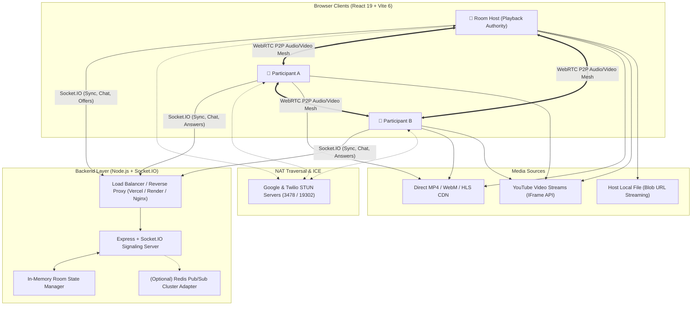
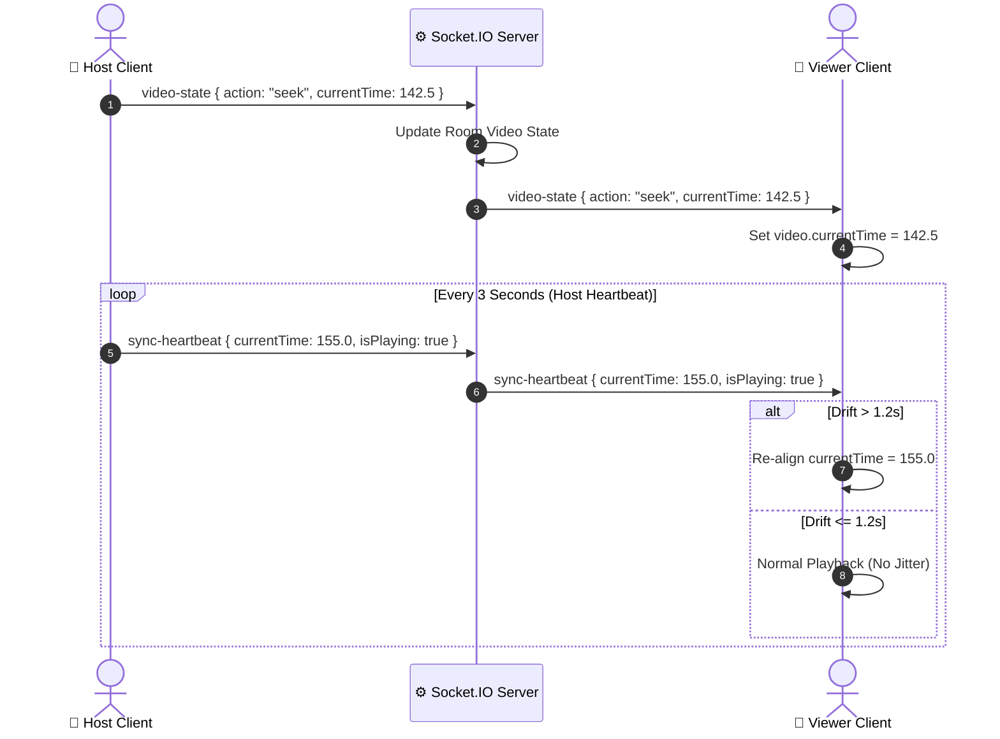
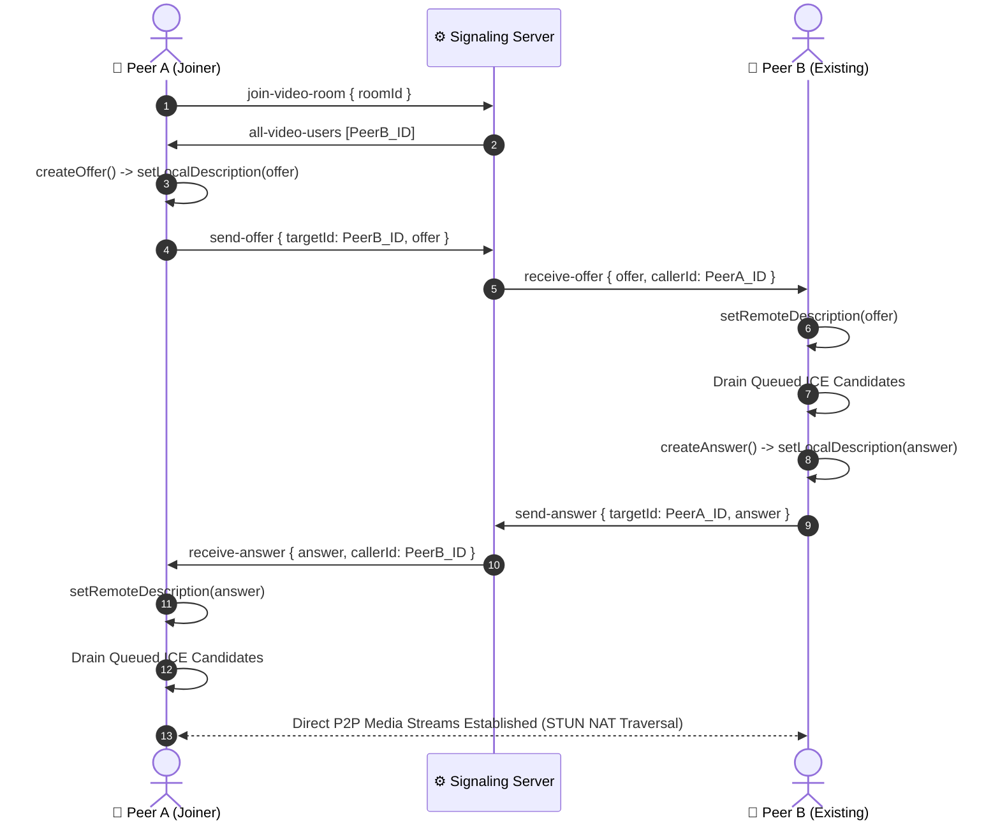
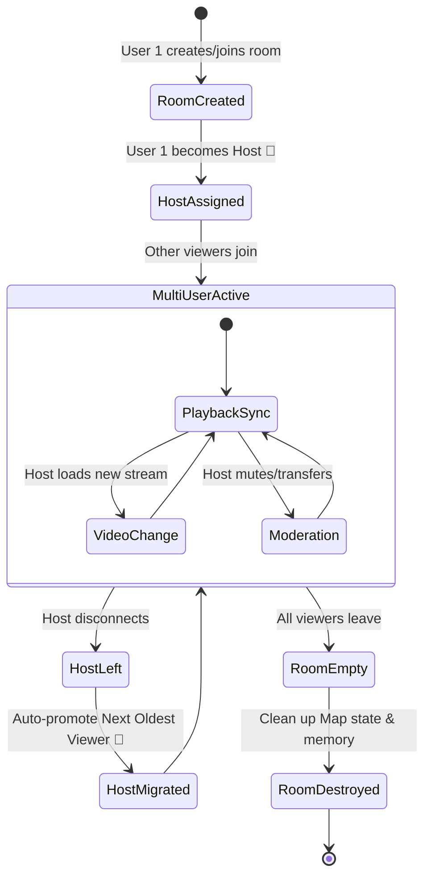
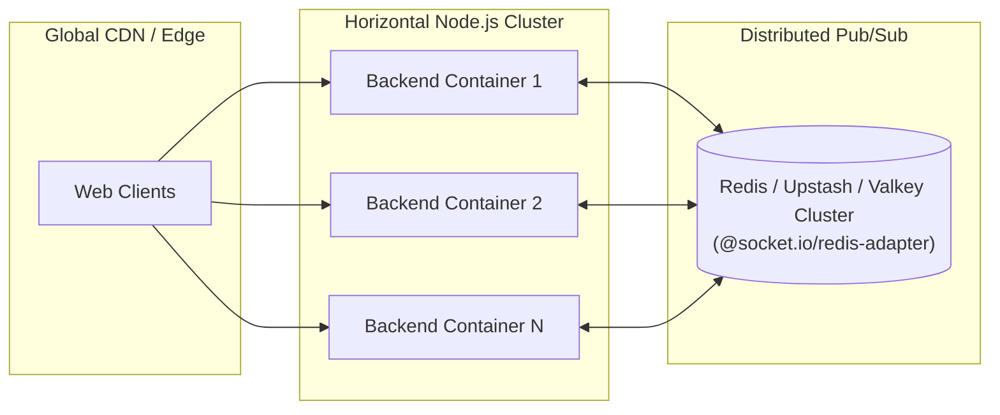

# 📐 Virtual Movie Streamer — System Design & Architecture

> **Real-Time Collaborative Virtual Cinema Platform with Native WebRTC Mesh, Server-Coordinated Media Synchronization, and Adaptive Multi-Source Streaming.**

---

## 1. 🏗️ High-Level System Architecture

Virtual Movie Streamer employs a hybrid **Client-Server + Peer-to-Peer (P2P)** architecture:
- **WebSocket Signaling & Sync Server (Node.js + Express + Socket.IO):** Coordinates room state, playback authority, chat messages, floating emoji reactions, and WebRTC SDP/ICE signaling.
- **Native WebRTC Full Mesh Grid:** Direct peer-to-peer audio/video feeds and screen sharing among participants without routing heavy media through central backend servers.
- **Unified Media Synchronization Engine:** Millisecond-level synchronization supporting HTML5 video streams (Direct MP4, WebM, HLS, Local Blobs) and embedded YouTube streams via the YouTube IFrame API.

---

## 2. ⏱️ Video Synchronization & Drift Correction Protocol

### A. Host-Authority Model
1. Only the active room **Host** can issue playback commands (`play`, `pause`, `seek`, `rate`, `change-video`).
2. Non-host participants follow host playback and can request immediate resynchronization at any time (`request-sync`).

### B. Elapsed-Time Elapsed Calculation
Instead of polling continuous video frames, the server computes real-time playback offsets using timestamp deltas:
$$\text{CalculatedTime} = \text{BaseCurrentTime} + \left(\frac{\text{Now} - \text{UpdatedAt}}{1000}\right) \times \text{PlaybackRate}$$

This ensures late-joining viewers start at the exact second the rest of the theater is watching.

### C. Heartbeat & Drift Smoothing
Every 3–4 seconds, the host emits a `sync-heartbeat`. Viewers compare local playback position against the host's heartbeat:
- **Drift $\le 1.2\text{s}$:** Local playback speed slightly adjusts to smooth out minor jitter.
- **Drift $> 1.2\text{s}$:** Direct seek alignment occurs to prevent viewer isolation.

---

## 3. 📹 WebRTC Mesh Video Conferencing Protocol

To ensure zero media latency, video chat runs directly peer-to-peer using native `RTCPeerConnection`:

### A. Candidate Queueing & Race Prevention
To prevent `InvalidStateError` when ICE candidates arrive before SDP negotiation completes:
1. When receiving an ICE candidate before `pc.remoteDescription` is set, the client queues it in `pendingIceCandidates[peerId]`.
2. As soon as `setRemoteDescription()` resolves, the queue is drained sequentially.

---

## 4. 👑 Room Lifecycle & Automatic Host Migration

---

## 5. 🛡️ Security, Rate Limiting & Input Sanitization

| Domain | Threat / Risk | Implemented Protection |
| :--- | :--- | :--- |
| **CORS Policy** | Unauthorized third-party WebSocket connections | Whitelist origin validation against `CLIENT_ORIGINS` environment variables |
| **Chat Flooding** | Denial of service / UI freeze | Sliding-window rate limit (max 6 messages per 2s per socket) |
| **Reaction Spam** | Burst load / animation lag | Sliding-window rate limit (max 4 reactions per 1.5s) |
| **Message Bounds** | Buffer overflow / giant string payloads | Strict substring truncation (500 chars text, 32 chars username, 10 chars emoji) |
| **Video State Bounds** | Negative offsets / infinite loop values | Positive finite number validation, playback rate clamped to $[0.25, 4.0]$ |
| **Media Track Injection** | Malicious track URI execution | Sanitized subtitle URL handling + WebVTT blob conversion |

---

## 6. 🌐 Scalability & Multi-Container Deployment

- **Standalone Mode (Default):** Runs an in-memory `RoomService` Map with zero external database dependencies for minimal latency and effortless local/single-container deployment.
- **Clustered Mode:** Automatically enables `@socket.io/redis-adapter` when `REDIS_URL` or `REDIS_HOST` is supplied, allowing rooms and signaling to broadcast across hundreds of horizontally scaled backend containers.
